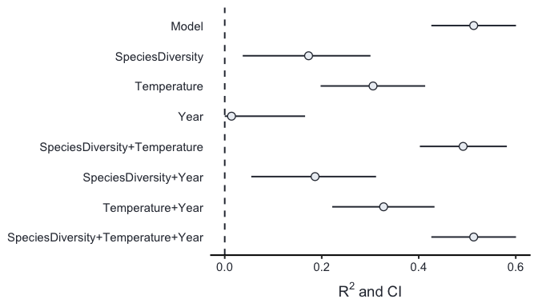

<!-- README.md is generated from README.Rmd. Please edit that file -->

# partR2

The goal of partR2 is to implement methods for LMMs and GLMMs to
estimate the R2 along with it’s confidence intervals as well as
partition the variation explained unique to and common among certain
predictors, which is useful in the case of multicollinearity.

partR2 is at the beginning of its development.

## Installation

You can install partR2 from github with:

``` r
# install.packages("devtools")
devtools::install_github("mastoffel/partR2")
```

## Example

``` r
library(partR2)
library(lme4)
#> Loading required package: Matrix

?partR2

# load data
data(BeetlesBody)
# fit lme4 model
mod <- lmer(BodyL ~ Sex + Treatment + Habitat + (1|Container) + (1|Population),
            data = BeetlesBody)

# partition R2
R2 <- partR2(mod, partvars = c("Sex", "Treatment", "Habitat"), 
                   R2_type = "marginal", nboot = 50, CI = 0.95)
R2
#> 
#> 
#> R2 (marginal) and CI (95%) for the full model: 
#>  R2    CI_lower CI_upper
#>  0.392 0.3      0.514   
#> 
#> ----------
#> 
#> Partitioned R2s:
#>  Predictor(s)          R2      CI_lower CI_upper
#>  Sex                   0.38584  0.294   0.51    
#>  Treatment             0.00520 -0.087   0.13    
#>  Habitat               0.00031 -0.092   0.12    
#>  Sex+Treatment         0.39119  0.299   0.51    
#>  Sex+Habitat           0.38626  0.294   0.51    
#>  Treatment+Habitat     0.00573 -0.086   0.13    
#>  Sex+Treatment+Habitat 0.39161  0.300   0.51    
#> 
#> ----------
#> 
#> Structure coefficients:
#>  Predictor    r(Yhat,x) CI_lower CI_upper
#>  SexMale      -0.7452   -0.86915 -0.627  
#>  TreatmentExp  0.0877    0.05210  0.132  
#>  HabitatB      0.0246   -0.00406  0.061
```

And to plot the results:

``` r
forestplot(R2, type = "R2")
```

<!-- -->
