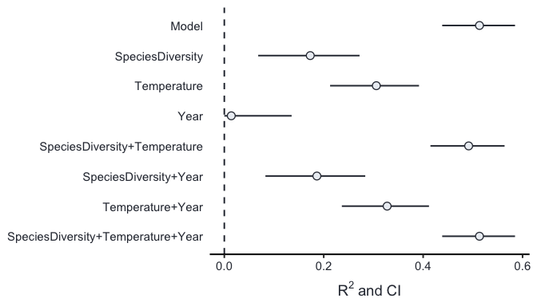

<!-- README.md is generated from README.Rmd. Please edit that file -->

# partR2

The goal of partR2 is to provide an estimate of R<sup>2</sup> in GLMMs
and to partition the R<sup>2</sup> into the variance explained by each
model component and by their combinations.

In addition to R<sup>2</sup> and partial R<sup>2</sup>’s the partR2
package calculates structure coefficients (SC). SC show the correlation
between a fixed effect and the predicted response and give an intuition
of the contribution of that fixed effect to the model prediction,
independent of all other predictors. Finally, partR2 also reports the
model estimates, i.e. the slopes and variances.

All estimates can be combined with parametric bootstrapping to get
confidence intervals.

partR2 is in an early phase of development and might still contain bugs.

## Installation

You can install partR2 from github with:

``` r
# install.packages("devtools")
devtools::install_github("mastoffel/partR2")
```

## Example

``` r
library(partR2)
library(lme4)

?partR2

# load data
data(biomass)
# fit lme4 model
mod <- lmer(Biomass ~  Year + Temperature + SpeciesDiversity + (1|Population),
            data = biomass)

(R2 <- partR2(mod,  partvars = c("SpeciesDiversity", "Temperature", "Year"),
                                 R2_type = "marginal", nboot = 100, CI = 0.95,
                                 data = biomass))
#> 
#> 
#> R2 (marginal) and 95% CI for the full model: 
#>  R2     CI_lower CI_upper nboot ndf
#>  0.5133 0.435    0.6096   100   4  
#> 
#> ----------
#> 
#> Partitioned R2s:
#>  Predictor(s)                      R2     CI_lower CI_upper nboot ndf
#>  Model                             0.5133  0.4350  0.6096   100   4  
#>  SpeciesDiversity                  0.1653  0.0870  0.2616   100   3  
#>  Temperature                       0.3038  0.2255  0.4001   100   3  
#>  Year                              0.0130 -0.0653  0.1093   100   3  
#>  SpeciesDiversity+Temperature      0.4914  0.4131  0.5877   100   2  
#>  SpeciesDiversity+Year             0.1784  0.1001  0.2747   100   2  
#>  Temperature+Year                  0.3250  0.2467  0.4213   100   2  
#>  SpeciesDiversity+Temperature+Year 0.5133  0.4350  0.6096   100   1
```

And to plot the
results:

``` r
forestplot(R2, type = "R2", line_size = 0.7, text_size = 14, point_size = 3)
```

<!-- -->
