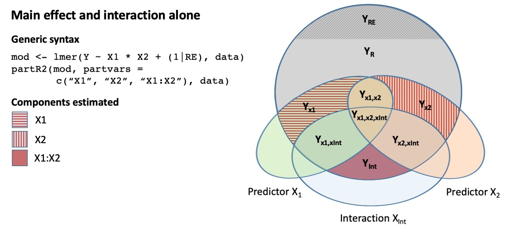
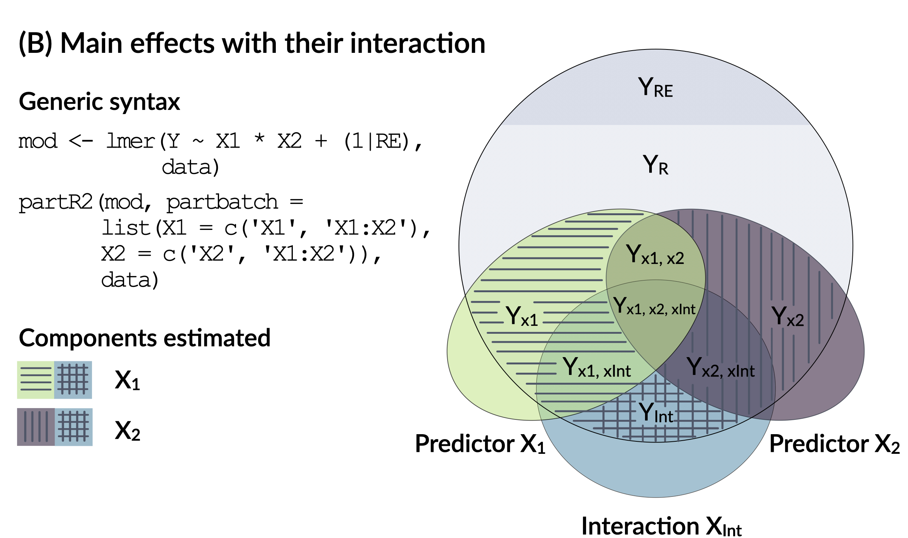
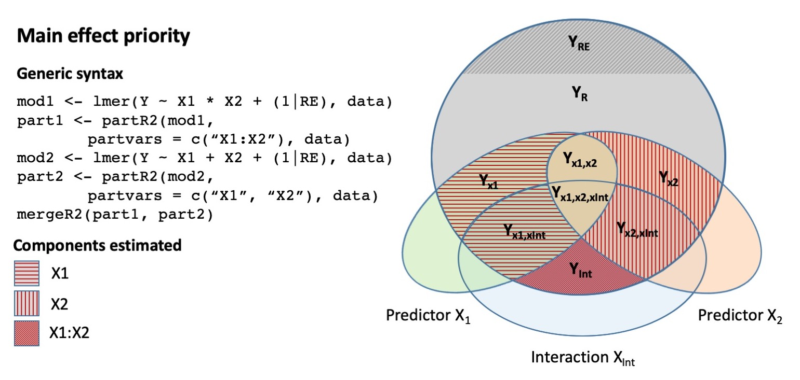

```{r, include = FALSE}
knitr::opts_chunk$set(
  collapse = TRUE,
  comment = "#>"
)
```

## partR2 package

The goal of `partR2` is to partition the variance explained in generalized linear mixed models (GLMMs) into variation unique to and shared among predictors. This can be done using semi-partial (or 'part') $R^2$ and inclusive $R^2$. But the package also does a few other things. Here is a quick summary of what the package calculates:

* Marginal and conditional $R^2$ (*sensu* Nakagawa & Schielzeth, 2013)
* Part $R^2$ unique to each predictor and combinations of (fixed effect) predictors
* Structure coefficients (SC), the contribution of a predictor to model prediction irrespective of other predictors (see Yeatts et al., 2017)
* Inclusive $R^2$ defined as the variance explained by a predictor irrespective of covariances with other predictors
* Standardized model estimates called beta weights
* Confidence intervals for all relevant estimators through parametric bootstrapping

## Installation

To install the development version of `partR2`:
```{r, eval=FALSE}
remotes::install_github("mastoffel/partR2") 
```

## Basic calculations

In order to use the package appropriately, it is important to know about the key quantities and how they are calculated. Here are some brief clarifications:

* Part $R^2$ is calculated by monitoring the reduction in the fixed effect variance (i.e. variance explained by the linear predictor) when a predictor (or set of predictors) is removed from the model, in relation to the total estimated variance. To calculate a single part $R^2$, we therefore fit two models: A full model and a reduced model, where the full model is the model specified by the user. 
* Structure coefficients are simply the correlation of a predictor with predicted values based on the fixed part of the model. Like other correlations, values of structure coefficients range -1 to +1. Structure coefficients are calculated from the full model as specified by the user.
* Inclusive $R^2$ is calculated as the the squared structure coefficient times the $R^2$ of the full model ($SC^2 * R^2$). The basic reasoning it that a) the square of structure coefficients provides an estimate of the proportion of variance explained in the linear predictor by a predictor of interest, b) the total $R^2$ of the full model provides an estimate of the proportion of variance explained by the linear predictor and c) the product of the two components gives an estimate of total contribution to the prediction relative to the variance explained.
* Beta weights are standardized regression coefficients and are here calculated post-hoc from the full model. For Gaussian data this is done by $\beta * (sd(x)/sd(y))$, where $\beta$ is the regression slope, $x$ is the covariate and $y$ is the response. For non-Gaussian data this is done by $\beta * sd(x)$, since for non-Gaussian models is not useful to standardize by the response. Note that this post-hoc standardization might not be the best option for standardization, for example for interactions or polynomials. Here, we recommend standardizing the variables before fitting the model. Alternative packages like `effectsize` (Makowski & Lüdecke, 2019) offer more flexible ways to estimate beta weights.

## `rptR` and `partR2`: ratios of variance components

The `rptR` package (Stoffel et al., 2017) and the `partR2` package go hand in hand. The intra-class coefficient or repeatability calculated in `rptR` is the proportion of variance explained by random effects while the `partR2` package estimates the proportion of variance explained by fixed effects (or fixed plus random effects when `R2_type = "conditional"`). Both the repeatability $R$ and the coefficient of determination $R^2$ are therefore ratios of variance components. However, we now changed the design of the `partR2` package compared to `rptR`. The `partR2` user now fits the model first in `lme4` so that any modeling problem can be recognized straight away. We think this is generally preferable as it separates the modeling part from the rest of the calculations and allows the user to focus on specifying an appropriate model first. 

## General use of the package

The workhorse of the package is a single function, `partR2()`. It takes a fitted model from `lme4` (Bates et al. 2015), with either a Gaussian, Poisson or binomial family. The function returns a `partR2` object. The package includes `print()`, `summary()` and `forestplot()` functions to display the results, and a helper function `mergeR2` that is useful for models with interactions (see below).

Before we go through some examples, we load the `biomass` dataset. This is a simulated dataset that aims to mimic a study on biomass production in grasslands. In a nutshell, virtual invertebrates were sampled once every year over 10 consecutive years (*Year*) from 20 different virtual populations (*Population*). *Temperature* and *Precipitation* were measured and overall species diversity (*SpeciesDiversity*) and *Biomass* were recorded for each *Population* in each *Year*.

```{r setup, message=FALSE}
library(partR2)
library(lme4)
data("biomass")
head(biomass)
```

## Part $R^2$ for Gaussian mixed models

First we fit a linear mixed model in `lme4`. We assume, that *Biomass* depends on effects of *Year*, *Temperature*, *Precipitation* and *SpeciesDiversity* (fitted as fixed effects) and *Population* (fitted as a random effect).

```{r, warning=FALSE}
modBM <- lmer(Biomass ~ Year + Temperature + Precipitation + 
             SpeciesDiversity + (1|Population), data = biomass)
```

Now we would usually do the standard model checks and evaluations to ensure that the model works well. For the sake of simplicity (and because we simulated the data from Gaussian distributions), we skip this step here and go straight into the analysis with `partR2`. We first calculate the overall marginal $R^2$ and use parametric bootstrapping to estimate confidence intervals. Marginal $R^2$ refers to the variance explained by fixed effect predictors relative to the total variance in the response. Alternatively, we can estimate conditional $R^2$ (by setting `R2_type ="conditional"`), which is the variance explained by fixed effects and random effects together relative to the total variance in the response.

Note that we supply the fitted `merMod` object (the `lme4` output) and the original dataset used to fit the model. If no data is provided, partR2 will try to fetch it, so it is usually not necessary to provide the data. There is one important thing to pay attention to: If there are missing observations for some of the predictors/response, `lmer` and `glmer` will remove all rows containing `NA`, which will result in a mismatch between the data in the `data` object and the data used to fit the model. In order to avoid complications, it is advisable to remove rows with missing data prior to the fitting the model. 

```{r, message=FALSE}
R2_BM <- partR2(modBM, data = biomass, R2_type = "marginal", nboot = 10)
R2_BM
```

Marginal $R^2$ is around 60% and confidence intervals are fairly narrow. *Temperature* and *Precipitation* are highly correlated in the dataset (as they often are in real-life situations) and we want to know how much each of them uniquely explains and what they explain together.

```{r, warning=FALSE}
R2_BMa <- partR2(modBM, partvars = c("Temperature", "Precipitation"), 
                  R2_type = "marginal", nboot = 10)
R2_BMa
```

So *Temperature* and *Precipitation* each uniquely explain only a small proportion of the variation in *Biomass* (around 4% and 9%, respectively). Together, however, they explain around 39% of the variation. This situation is typical for correlated predictors, since part $R^2$ is the variance *uniquely* explained by each predictor, while here a large part of the variance is explained equally by both predictors. If *Temperature* is removed from the model, the variance explained is only marginally reduced, because *Precipitation* still explains a large part of the variance in *Biomass* (and vice versa). 

Besides part $R^2$, `partR2` also estimates inclusive $R^2$, standardized model estimates (beta weights) and structure coefficients. These are shown when calling the `summary()` function. 

```{r, warning=FALSE}
summary(R2_BMa)
```

Beta weights (BW) show that all four predictors seem to have an effect on *Biomass*, because none of the confidence intervals overlaps zero. The effect of *Precipitation* appears largest. Structure coefficients (SC) tell us that both *Temperature* and *Precipitation* are quite strongly correlated with the overall model prediction. Structure coefficients are correlations and by squaring them followed by multiplications with the marginal $R^2$ of the full model, we get inclusive $R^2$ ($IR^2 = SC^2 * R^2$). SC and $IR^2$ are large for *Temperature* and *Precipitation* as both are highly correlated to the predicted response, but their part $R^2$ (the variance that they uniquely explain) are small due to their collinearity. 

## Controlling predictor combinations

By default, `partR2` calculates part $R^2$ for all predictors individually and in all possible combinations. The number of combinations increases exponentially with $2^n-1$ combinations for $n$ predictors. This increases computation time exponentially. There are two options to control the number of $R^2$ to be calculated. Sometimes we want only part $R^2$ for each predictor, but not for all their combinations. We can specify this with the argument `max_level = 1`.

```{r, warning=FALSE}
R2_BMb <- partR2(modBM, partvars = c("Temperature", "Precipitation", "Year", 
                                     "SpeciesDiversity"), 
                R2_type = "marginal", max_level = 1, nboot = 10)
R2_BMb
```

Another option is offered by the `partbatch` argument. `partbatch` takes a list of character vectors that contain predictor names. The terms in each character vector are then always fitted or removed together. This is most useful for models with many variables, when using dummy coding or when predictors are otherwise linked in any meaningful way. We illustrate the use of `partbatch` here by requesting part $R^2$ for the two climatic variables (*Temperature* and *Precipitation*) in combination.

```{r, warning=FALSE}
R2_BMc <- partR2(modBM, partbatch = list(c("Temperature", "Precipitation")),
                   R2_type = "marginal", nboot = 10)
R2_BMc
```

`partbatch` can be used instead of or in combination with `partvars`. For convenience it is also possible to name the elements in the list given to `partbatch`. The output will then show the name of the batch instead of all list elements. We now request part $R^2$ for the two climatic variables (now named *ClimateVars*) along with *SpeciesDiversity*.

```{r, warning=FALSE}
R2_BMd <- partR2(modBM, partvars = c("SpeciesDiversity"), 
                   partbatch = list(ClimateVars = c("Temperature", "Precipitation")),
                   R2_type = "marginal", nboot = 10)
R2_BMd
```

## Plotting and data extraction

We can plot the results as forestplots, powered by `ggplot2` (Wickham, 2016). The output of `forestplot` is a `ggplot` object. We can customize the object using `ggplot` syntax or assemble multiple plots with packages like `patchwork` (Pedersen, 2019). In the example here, we added a few arguments for a nicer appearance (see `?forestplot` for more information). What is plotted is controlled by the `type` argument, which can be `type = "R2"` (the default)  for part $R^2$, `type = "IR2"` for inclusive $R^2$, `type = "SC"` for structure coefficients, `type = "BW"` for beta weights and `type = "Ests"` for raw model estimates.

```{r, fig.width = 7, fig.height=5}
library(patchwork)
p1 <- forestplot(R2_BMb, type = "R2", text_size = 10)
p2 <- forestplot(R2_BMb, type = "IR2", text_size = 10)
p3 <- forestplot(R2_BMb, type = "SC", text_size = 10)
p4 <- forestplot(R2_BMb, type = "BW", text_size = 10)
(p1 + p2) / (p3 + p4) + plot_annotation(tag_levels = "A")
```

However, for a publication we might want the data extract the results either for more customized plotting or because we want to present it in a table. Here is how the results can be retrieved from a `partR2` object:

```{r}
# An overview
str(R2_BMb, max.level = 1)
```

The list shows the key elements of `partR2` that contain (a) the point estimates and confidence intervals and (b) bootstrap replicates. Note that each bootstrap replicate refers to a fit to a simulated dataset (data simulated based on model estimates). Notably, bootstrap estimates are stored in list columns. Every element in a list column contains a vector with all bootstrap estimates for a given term. 

```{r, results=FALSE}
# (a) point estimates and confidence intervals
R2_BMb$R2   # R2s
R2_BMb$SC   # Structure coefficients
R2_BMb$IR2  # inclusive R2s
R2_BMb$BW # Standardised model estimates
R2_BMb$Ests # Model estimates
# (b) bootstrap replicates
R2_BMb$R2_boot
R2_BMb$SC_boot
R2_BMb$IR2_boot
R2_BMb$BW_boot
R2_BMb$Ests_boot
```

## Warnings messages

Parametric bootstrapping works through simulation of new response variables based on model estimates, followed by refitting the model to these simulated responses. This regularly causes warnings, usually reporting convergence problems or singularity warnings. Such warning messages often occur when one of the components is close to zero (often one of the random effects). Removing those components often prevents warning messages. However, if the cause of warnings is that some component is estimated at the boundary, then this does not constitute a major problem. It is more important that the original model fit is scrutinized for model validity than every single bootstrap iteration. Nevertheless, `partR2` captures warnings (and messages) and saves them in the return object. Lets have a look at potential warnings and messages for the first two simulations, though it turns out there are none in this analysis.

```{r, warning=FALSE}
R2_BMb$boot_warnings[1:2]
R2_BMb$boot_messages[1:2]
```

### Models with transformations in the formula

We generally advice to do all variable transformation before fitting the model. Otherwise it is important to specify the variable in the `partvars` (or `partbatch`) argument exactly (!) how it was done in the original model fit. Here is an example where we fit an additional term for *Precipitation^2*. A model with *Precipitation* and *Precipitation^2* produces warning messages, because of the strong correlation between the linear and the squared term. This can be solved by centering before squaring (see Schielzeth 2010).  

```{r, warning=FALSE}
biomass$PrecipitationC <- biomass$Precipitation - mean(biomass$Precipitation)
modBMC <- lmer(Biomass ~ Temperature + PrecipitationC + 
               I(PrecipitationC^2) + (1|Population), 
               data = biomass)
R2_BMe <- partR2(modBMC, partvars = c("Temperature"), partbatch=list(c("PrecipitationC", "I(PrecipitationC^2)")), 
                 nboot = 10)
R2_BMe
```

More generally, we have previously had problems with partial matching (e.g. terms *female* and *male* in the same model). Although this problem should now be fixed, it is worth to be aware that unusual names may cause complications and renaming usually offers an easy solution.

## Running `partR2` in parallel

Parametric bootstrapping is an inherently slow process, because it involves repeated fitting of mixed effects models. Furthermore, computation time increases exponentially with the number of terms requested, all being tested in isolation and in combination. It is therefore advisable to run preliminary analyses first with low numbers of bootstraps, just to see that things work and make sense in principle. The final analysis should be done with a large number of bootstraps (at least 100, better 1000). This can take time.

A simple way to save runtime is to distribute the bootstrap iterations across multiple cores. `partR2` parallelises with the `future` (Bengtsson, 2019) and `furrr` (Vaughan & Dancho, 2018) packages. This makes it flexible for the user on how exactly to parallelise and should work on whatever OS you are running your analyses, be it Mac, Windows or Linux. 

We illustrate the parallel option of `partR2` with the `modBM` fitted above. First we specify how we want to parallelise using future's `plan()` function. Check out `?future::plan` for more information. Generally, if you the analysis is run in RStudio, it is recommended to use `plan(multisession)`. After specifying the plan, you need to set the `parallel = TRUE` argument when calling  `partR2()` and bootstrapping will run in parallel. If there is no specified plan, `partR2` will still run sequentially.

```{r, warning=FALSE, message=FALSE}
library(future)
# how many cores do I have?
parallel::detectCores()
# specify plan
# workers can now be set to multiple cores to parallelise 
plan(multisession, workers = 2)
R2_BMf <- partR2(modBM, partvars = c("Temperature", "Precipitation"), 
                        parallel = TRUE, data = biomass)
```

## Part $R^2$ for Poisson and binomial mixed models

Partitioning $R^2$ in Poisson and binomial models works with the same `partR2` function, in the same way as for Gaussian data. Here, we simulated a Poisson distributed response variable *Extinction* for the biomass dataset.

```{r, fig.width=5, fig.height=3}
hist(biomass$Extinction)
```

First we fit a Poisson model using `lme4::glmer` with *Year*, *Temperature*, *Precipitation* and *SpeciesDiversity* as fixed effect predictors and *Population* as a random effect. Then we request part $R^2$ for *Temperature* and *Precipitation*. 

Since a model with raw predictors produces warning messages (and the recommendation to scale variables), we scale *Temperature* and *Precipitation* and center *Year* and *SpeciesDiversity*.
```{r, warning=FALSE}
biomass$YearC <- biomass$Year - mean(biomass$Year)
biomass$TemperatureS <- scale(biomass$Temperature)
biomass$PrecipitationS <- scale(biomass$Precipitation)
biomass$SpeciesDiversityC <- biomass$SpeciesDiversity - mean(biomass$SpeciesDiversity)

modExt <- glmer(Extinction ~ YearC +  TemperatureS + PrecipitationS + 
                SpeciesDiversityC + (1|Population),
                data=biomass, family="poisson")
R2_Ext <- partR2(modExt, partvars = c("TemperatureS", "PrecipitationS"),
                 R2_type = "marginal", nboot=10)
print(R2_Ext, round_to = 3) # rounding decimals in print and summary
```

We also simulated a proportion-scale response variables *Recovered* and *NotRecovered* for the biomass dataset. Again, we first fit a Binomial model using `lme4::glmer` with *Year*, *Temperature*, *Precipitation* and *SpeciesDiversity* as fixed effect predictors and *Population* as a random effect. Then we calculate part $R^2$ for *Temperature* and *Precipitation*. Again, we use centered/scaled predictors to facilitate model convergence.

```{r, message=FALSE, warning=FALSE}
modRecov <- glmer(cbind(Recovered, NotRecovered) ~ YearC + 
              TemperatureS + PrecipitationS + SpeciesDiversityC + (1|Population),
              data=biomass, family="binomial")
R2_Recov <- partR2(modRecov, partvars = c("TemperatureS", "PrecipitationS"),
                   R2_type = "marginal", nboot=10)
summary(R2_Recov, round_to=3)
```

Both Poisson and binomials models give low $R^2$ values -- even though they have been generated with similar parameter settings as the Gaussian data. This situation is common and originates from the inherent rounding when traits are expressed as discrete or binary numbers. Fixed and random effects explain variation only at the latent scale, but inherent distribution-specific variance contribute to the residual variances. This leads to large residual variance and relatively lower explained variance components.

One thing to keep in mind when using GLMMs are observation-level random effects (OLRE, see Harrison 2014). `partR2` fits OLRE internally to quantify overdispersion but the function will recognise an OLRE when it is already fitted in the model. Fitting of OLRE can be suppressed by `olre = FALSE` in case this is required. (Note, that we do not fit an OLRE for binomial models with binary responses because in this case there is no overdispersion.) 


## Dealing with part $R^2$ for interactions

It is possible to estimate part $R^2$ for models with interaction terms, but this requires some thought. Recall that the part $R^2$ of a predictor is calculated as the reduction in the variance explained after the predictor is removed from the model. Interactions are the product of two predictors. When raw covariates are multiplied with each other, the product (=the interaction) is usually highly correlated with each one of the main effects. Hence, interactions and main effects tend to have a large overlap in the variance that they explain in the response. This can lead to erroneous conclusions. A generally useful strategies when dealing with models with interactions is to center all covariates, because this usually mitigates the correlations and makes main effects independent of interactions (Schielzeth 2010). However, even with centered covariates there are different options on how we can partition the variance explained. 

We will introduce these options with the `guinea pig` dataset (Mutwill et al. in prep.). The dataset contains testosterone measurements of 31 male guinea pigs, each measured at 5 time points. We will analyze log-transformed testosterone titers (*Testo*) and fit male identify (*MaleID*) as a random effect. As covariates the dataset contains *Time* (time point of measurement) and a *Rank* (rank index quantified from behavioral observations). 

```{r, message=FALSE}
data(GuineaPigs)
head(GuineaPigs)
GuineaPigs <- subset(GuineaPigs, !is.na(Testo) & !is.na(Rank))
GuineaPigs$TestoTrans <- log(GuineaPigs$Testo)
```


#### Estimate main effects despite interactions

One option is to estimate the variance explained by main effects irrespective of whether there are interactions. We can do this, as usual, by specifying main effects (and interactions) in the `partvars` argument. `partR2` will then iteratively remove each of those predictors and 
will treat interactions and main effects equally. 

```{r, warning=FALSE}
modGP <- lmer(TestoTrans ~ Rank * Time + (1|MaleID), data=GuineaPigs)
R2_modGPa <- partR2(modGP, partvars = c("Rank", "Time", "Rank:Time"), nboot=10)
R2_modGPa
```

A conceptual Venn diagram shows what has been estimated. Y illustrates the total variance of the response (here *TestoTrans*), Y~RE~ the variance explained by random effects (here *MaleID*) and Y~R~ the residual variance. The other fields are the variance explained by the main effects (e.g. X1 = *Rank* and X2 = *Time*) and their interaction (Xint). Intersections show parts of the phenotypic variance explained by multiple components. What we have estimated is the variance uniquely explained by main effects and uniquely explained by the interaction. The variance explained that is shared between main effects and the interaction is neither attributed to the main effect nor the interaction. Instead we have estimated the variance Y~x1~ (horizontal stripes,*Rank*) and Y~x2~ (vertical stripes, *Time*). Finally, Y~int~ (dotted) is attributed to the the interaction (*Rank*:*Time*).

{ width=80% }

#### Pooling main effect and interaction variance

One way to think about variance explained by main effects and their interactions is to pool the variance explained by a main effect with the variance explained by interactions that the term is involved in. *Rank* might be considered important either as a main effect or in interaction with *Time* and we might want to estimate the total effect of *Rank*. The same might be true for *Time*. This can be done using the `partbatch` argument.

```{r, warning=FALSE}
R2_modGPb <- partR2(modGP, partbatch = list(c("Rank", "Rank:Time"), 
                                            c("Time", "Rank:Time")),
                        data = GuineaPigs, nboot = 10)
R2_modGPb
```

A conceptual Venn diagram shows what has been estimated. Here, Y~X1~ is the (combined) part $R^2$ for *Rank* and *Rank*:*Time* (horizontal stripes), and Y~X2~ is the (combined) part $R^2$ for *Time* and *Rank*:*Time* (vertical stripes). Note that the interaction variance is attributed to both components (area with horizontal and vertical stripes). 

{ width=80% }


#### Prioritising main effects

The last option is the one that we think is usually preferable. The option involves prioritising main effects by assigning the proportion of variance that is explained by a main effect together with the variance jointly explained with its interaction to the main effect. This implies that first, only the part $R^2$ for the interaction is calculated from a model fit (`modGP1` and `R2_GPc_part1` below). In a second model fit, the variance explained by the main effects is estimated when their interaction is excluded from the model (`modGP2` and `R2_GP_part2` below).  We have implemented a helper function `mergeR2` that allows to merge the two `partR2` runs.

```{r, warning=FALSE}
modGP1 <- lmer(TestoTrans ~ Rank * Time + (1|MaleID), data = GuineaPigs)
R2_GPc_part1 <- partR2(modGP1, partvars = c("Rank:Time"), data = GuineaPigs, 
                       nboot = 10)

modGP2 <- lmer(TestoTrans ~ Rank + Time + (1|MaleID), data = GuineaPigs)
R2_GPc_part2 <- partR2(modGP2, partvars = c("Rank", "Time"), data = GuineaPigs,
                   max_level = 1, nboot = 10)
# the first partR2 object is based on the full model
R2_GPc <- mergeR2(R2_GPc_part1, R2_GPc_part2) 
R2_GPc
```

A conceptual Venn diagram shows what has been estimated. The model now assigns variance explained by a main effect, including the variance shared with its interaction, to the main effect. Here, X1 is the part $R^2$ for *Rank* (horizontal stripes), and X2 is the (combined) part $R^2$ for  (vertical stripes) and the variance uniquely explained by the interaction (*Rank*:*Time*) is estimated separately (dotted).

{ width=80% }


#### Interactions with factorial predictors

Another special case are interactions involving factorial predictors. For illustration, we fit *Time* in the guinea pig analysis as a five-level factor.

```{r, warning=FALSE}
GuineaPigs$TimeF <- factor(GuineaPigs$Time)
modGPF <- lmer(TestoTrans ~ Rank * TimeF + (1|MaleID), data=GuineaPigs)
R2_modGPFa <- partR2(modGPF, partvars = c("Rank", "TimeF", "Rank:TimeF"), 
                     nboot=10)
R2_modGPFa
```

The column `ndf` shows that the full model and the model without *Rank* have the same numbers of fitted parameters. For such a model with one covariate, a five-level factor and their interaction, the model has estimated ten parameters in the fixed part: one intercept, one for the main effect of the covariate *Rank*, four contrasts for the main-effect of the factor *TimeF* and four contrasts for the interaction *Rank*:*TimeF*. If the covariate is removed from the model, the contrasts will be reparameterized, such that there are still ten parameters estimated in the fixed part: one intercept, four contrast for the main-effect of the factor *TimeF*, and now five for the interactions *Rank*:*TimeF*.

One way to prevent this reparametrization of the design matrices is the use of dummy coded variables. We include dummy-coded variabels in the data frame and also center them. 

```{r, warning=FALSE}
GuineaPigs <- cbind(GuineaPigs, model.matrix(~ 0 + TimeF, data=GuineaPigs))
GuineaPigs$TimeF2 <- GuineaPigs$TimeF2 - mean(GuineaPigs$TimeF2)
GuineaPigs$TimeF3 <- GuineaPigs$TimeF3 - mean(GuineaPigs$TimeF3)
GuineaPigs$TimeF4 <- GuineaPigs$TimeF4 - mean(GuineaPigs$TimeF4)
GuineaPigs$TimeF5 <- GuineaPigs$TimeF5 - mean(GuineaPigs$TimeF5)
```

Now we can keep the four dummy-coded (and centered) *TimeF* variables together in a named `partbatch` argument.

```{r, warning=FALSE}
batch <- c("TimeF2", "TimeF3", "TimeF4", "TimeF5")
modGPFD <- lmer(TestoTrans ~ (TimeF2 + TimeF3 + TimeF4 + TimeF5) * Rank + 
                (1|MaleID), data=GuineaPigs)
R2_GPFD <- partR2(modGPFD, partvars=c("Rank"), 
                  partbatch=list(TimeF=batch, `TimeF:Rank`=paste0(batch, ":Rank")), 
                  nboot=10)
R2_GPFD
```


### Beta Weights for interactions

Standardised model estimates or beta weights are difficult to calculate for models with interactions (including polynomials, which are essentially interactions of a variable with itself). While there are specialised packages like `effectsize` (Makowski & Lüdecke, 2019) to standardize model estimates, we recommend standardising the variables involved in interactions or polynomials before fitting the model.  We will again use the guinea pig dataset with *Rank* and *Time* fitted as a continuous, but now scaled variables.

```{r}
GuineaPigs$TestoTransS <- scale(GuineaPigs$TestoTrans)
GuineaPigs$TimeS <- scale(GuineaPigs$Time)
GuineaPigs$RankS <- scale(GuineaPigs$Rank)
modGPS <- lmer(TestoTrans ~ RankS * TimeS + (1|MaleID), data = GuineaPigs)
```

We then run the `partR2` analysis. In the case of (pre-)standardised variables, it is useful to look at the model estimates instead of beta weights (since the latter are posthoc standardized). The `summary()` function takes an additional argument `ests = TRUE` display them. The estimates from pre-standardized variable are preferable over post-standardized BW for interactions and polynomials. However, the difference is small in this case.

```{r}
R2_GPS <- partR2(modGPS, nboot = 10)
summary(R2_GPS, ests = TRUE)
```


## Literature

Bates, D. M., Maechler, M., Bolker, B. M. & Walker, S. (2015). Fitting linear mixed-effects models using lme4. Journal of Statistical Software 67: 1-48.

Bengtsson, H. (2019). future: Unified Parallel and Distributed Processing in R for Everyone. R
package version 1.14.0. https://CRAN.R-project.org/package=future

Faraway, J. J. (2014). Linear models with R. CRC press, Boca Raton.

Harrison, X. A. (2014). Using observation-level random effects to model overdispersion in count data in ecology and evolution. PeerJ 2: e616.

Makowski, B.-S. & Lüdecke, D. (2019). Compute and interpret indices of effect size. R package. https://github.com/easystats/effectsize.

Mutwill, A.M., Schielzeth, H., Zimmermann, T.D., Richter, H., Kaiser, S. & Sachser, N. (in prep.). Endocrine mechanisms underlying dominance rank acquisition in males: individuality meets plasticity in a complex social environment.

Nakagawa, S., & Schielzeth, H. (2010). Repeatability for Gaussian and non-Gaussian data: a practical guide for biologists. Biological Reviews 85: 935-956.

Nakagawa, S. & Schielzeth, H. (2013). A general and simple method for obtaining R2 from generalized linear mixed-effects models. Methods in Ecology and Evolution 4: 133-142.

Schielzeth, H. (2010). Simple means to improve the interpretability of regression coefficients. Methods in Ecology and Evolution 1: 103-113.

Stoffel, M. A., Nakagawa, S. & Schielzeth, H. (2017). rptR: Repeatability estimation and variance decomposition by generalized linear mixed-effects models. Methods in Ecology and Evolution 8: 1639-1644.

Vaughan, D. & Dancho, M. (2018). furrr: Apply Mapping Functions in Parallel using Futures. R
package version 0.1.0. https://CRAN.R-project.org/package=furrr

Wickham, H. (2016). ggplot2: elegant graphics for data analysis. Springer, London.

Yeatts, P.E., Barton, M., Henson, R.K. & Martin, S.B. (2017). The use of structure coefficients to address multicollinearity in sport and exercise science. Measurement in Physical Education and Exercise Science 21: 83-91.
