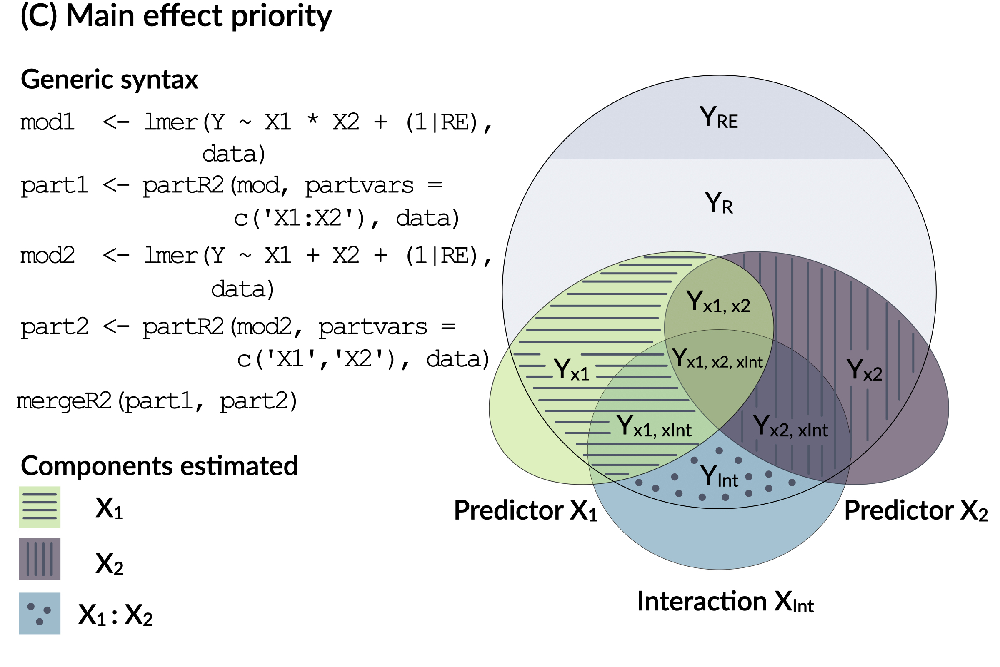

```{r, include = FALSE}
knitr::opts_chunk$set(
  collapse = TRUE,
  comment = "#>"
)
```


The goal of `partR2` is to partition the variance explained in generalized linear mixed models (GLMMs) into variation unique to and shared among predictors. This can be done using semi-partial (or 'part') $R^2$ and inclusive $R^2$. But the package also does a few other things. Here is a quick summary of what the package calculates:

* Marginal and conditional $R^2$ (*sensu* Nakagawa & Schielzeth, 2013)
* Part $R^2$ unique to each predictor and combinations of predictors (fixed effects)
* Structure coefficients (SC), the contribution of a predictor to the model prediction when ignoring all other predictors (see Yeatts et al., 2017)
* Inclusive $R^2$ defined as the variance explained by a predictor irrespective of covariances with other predictors. 
* Standardized model estimates called beta weights
* Confidence intervals for all relevant estimators through parametric bootstrapping

## Basic calculations

In order to use the package appropriately, it is important to understand what the key quantities are. Here are some brief clarifications and general procedures of internal calculation:

* Part $R^2$ is calculated as the reduction in the total variance explained when a predictor of interest is removed from the model. The calculation of a single part $R^2$ thus involves fitting two models: A full model and a reduced model. The full model is the model specified by the user. Likewise, part $R^2$ for combinations of predictors is calculated as the reduction in the total variance explained when a set predictors of interest is removed from the model.
* Structure coefficients are simply the correlation of a predictor with predicted values based on the fixed part of the model. Like other correlations, values of structure coefficients range -1 to +1. Structure coefficients are calculated from the full model as specified by the user.
* Inclusive $R^2$ is calculated as the the squared structure coefficient times the $R^2$ of the full model ($SC^2 * R^2$). The basic reasoning it that (a) the squared of structure coefficients provides and estimate of the proportion of variance explained in the linear predictor by a predictor of interest, (b) that the total $R^2$ of the full model provides and estimated of the proportion of variance explained by the linear predictor and (c) the product of the two components gives an estimated of total contribution to prediction in proportion of the variance to be explained.
* Beta weights are standardized regression coefficients and are here calculated post-hoc from the full model. For Gaussian data this is done by $\beta * (sd(x)/sd(y))$, where $\beta$ is the regression slope, $x$ is the covariate and $y$ is the response.  For non-Gaussian data this is done by $\beta * sd(x)$, since for non-Gaussian models is not useful to standardize by the response. Note that this posthoc standardization might not be the best option for standardization, for example for interactions or polynomials. Here, we recommend standardizing the variables yourself before fitting the model. Alternative packages like `effectsize` (Makowski & Lüdecke, 2019) offer more flexible ways for the estimation of beta weights.


## General use of the package

The workhorse of the package is a single function, `partR2()`. It takes a fitted model from `lme4` (Bates et al. 2015), with either a Gaussian, Poisson or binomial family. The function returns a `partR2` object. The package inclues `print()`, `summary()` and `forestplot()` functions for display of results, and a helper function `mergeR2` that is mostly useful for models with interactions (see below).

Before we go through some examples, we load the `biomass` dataset. This is a simulated dataset that aims to mimic a study on biomass production in grasslands. In a nutshell, virtual invertebrates were sampled once every year over 10 successive years (*Year*) from 20 different virtual populations (*Population*). *Temperature* and *Precipitation* were measured and overall species diversity (*SpeciesDiversity*) and *Biomass* were recorded for each *Population* in each *Year*.

```{r setup, message=FALSE}
# remotes::install_github("mastoffel/partR2)
library(partR2)
library(lme4)
data("biomass")
head(biomass)
```

## Partitioning $R^2$ in a Gaussian mixed model

First we fit a linear mixed model in `lme4`. We assume, that *Biomass* depends on effects of the *Year*, *Temperature*, *Precipitation* and *SpeciesDiversity*. We also fit a random effect to account for differences among populations.

```{r, warning=FALSE}
mod1 <- lmer(Biomass ~ Year + Temperature + Precipitation + 
             SpeciesDiversity + (1|Population), 
             data = biomass)
```

Now we would usually do the standard model checks and evaluations to ensure that the model works well. For the sake of simplicity (and because we simulated the data from Gaussian distributions), we skip this step here and go straight into the `partR2` part. We first calculate the overall marginal $R^2$ and use parametric bootstrapping to estimate confidence intervals. Marginal $R^2$ refers to the variance explained by fixed effect predictors relative to the total variance in the response. Alternatively, we can estimate conditional $R^2$ (by setting `R2_type ="conditional"`), which is the variance explained by fixed effects and random effects together relative to the total variance in the response.

Note that we are supplying the fitted `merMod` object (the `lme4` output) and the original dataset (in the `data` argument) used to fit the model.  This is required, because the `merMod` object does not contain all necessary information to perform the `partR2` analysis. There is one important thing to pay attention to: If there are missing observations for some of the predictors/response, `lmer` and `glmer` will remove those rows containing NAs, which will result in a mismatch between the data in the `data` object and the data used fit the model. In order to avoid complications, it is advisable to remove rows with missing data prior to the fitting the model. 

```{r, message=FALSE}
R2_mod1 <- partR2(mod1, data = biomass, R2_type = "marginal", nboot = 10)
R2_mod1
```

Marginal $R^2$ is around 60% and confidence intervals are fairly narrow. *Temperature* and *Precipitation* are highly correlated in the dataset (as they often are in real-life situations) and we want to know how much each of them uniquely explains and what they explain together.

```{r, warning=FALSE}
R2_mod1 <- partR2(mod1, partvars = c("Temperature", "Precipitation"), 
                  data = biomass, R2_type = "marginal", nboot = 10)
R2_mod1
```

So it seems that *Temperature* and *Precipitation* uniquely only explain around 4% and 9% in the variation in *Biomass*, respectively. Together however, they explain around 39% of the variation. This situation is typical for correlated predictors, since part $R^2$ is the variance *uniquely* explained by each predictor, while a large part of the variance is explained by both predictors. Part $R^2$ is calculated as the difference in $R^2$ between the full model and a reduced model which does not contain the respective predictor of interest. Hence, if *Temperature* is removed, the explained variances is not greatly reduced, because the variance is still explained by *Precipitation* (as both are highly correlated). 

Besides part $R^2$, `partR2` also outputs inclusive $R^2$, standardized model estimates (beta weights), and structure coefficients, which are shown when calling the `summary()` function. 
```{r, warning=FALSE}
summary(R2_mod1)
```

The beta weights (BW) show that all four predictors seem to have some effect on *Biomass* because none of the confidence intervals overlaps zero, while the effect of *Precipitation* is largest. Structure coefficients tell us that both *Temperature* and *Precipitation* are quite strongly correlated with overall model prediction. Structure coefficients effectively give us the contribution of a predictor to the model prediction in the absence of all other predictors (with a maximum magnitude of ±1). SC are correlation coefficients and by squaring them and multiplying by the marginal $R^2$ of the model we get what we call inclusive $R^2$ or short $IR^2$ ($IR^2 = SC^2 * R^2$). SC and $IR^2$ are large for *Temperature* and *Precipitation* as both are highly correlated to the predicted response, but their part $R^2$ (the variance that they uniquely explain) are small due to their correlation. 

## Limiting the amount of combinations

The number of combinations for part $R^2$ increases exponentially with $2^n-1$ combinations for $n$ predictors. There are two options to decrease the number of sets for which $R^2$ is calculated and to reduce the computational burden. Our model `mod1` has four predictors and hence $2^4-1 = 15$ combinations. If we only wanted the part $R^2$ for each predictor but not their combinations, we can specify `max_level = 1`.

```{r, warning=FALSE}
R2_short <- partR2(mod1, partvars = c("Temperature", "Precipitation", "Year", "SpeciesDiversity"), 
                    data = biomass, R2_type = "marginal", max_level = 1)
R2_short
```

`max_level = 2` would give all combinations up to a maximum of two predictors and so on. 

Another option is offered by the `partbatch` argument which takes a list of character vectors. The terms in each character vector are then always fitted or removed together. This is most useful for models with many variables, when using dummy coding or when predictors are otherwise linked in any meaningful way. 


```{r, warning=FALSE}
R2_batch <- partR2(mod1, partvars = c("SpeciesDiversity"), 
                   partbatch = list(c("Temperature", "Precipitation")),
                   R2_type = "marginal", data = biomass)
R2_batch
```

For convenience it is also possible to name the elements in the list given to `partbatch`, then the output shows the name of the batch instead of all single list elements (here `ClimateVars`).

```{r, warning=FALSE}
R2_batch <- partR2(mod1, partvars = c("SpeciesDiversity"), 
                   partbatch = list(ClimateVars = c("Temperature", "Precipitation")),
                   R2_type = "marginal", data = biomass)
R2_batch
```

## Plotting

We can now plot the results as forestplots, powered by `ggplot2` (Wickham, 2016). We added a few arguments to easily customize the plot, see `?forestplot`.

```{r, fig.width = 4, fig.height=2.5}
forestplot(R2_mod1, type = "R2", line_size = 0.5, text_size = 12, point_size = 3)
```

The output of `forestplot` is a `ggplot` object so we can change it using ggplot syntax or assemble multiple plots with packages like `patchwork` (Pedersen, 2019). We can also plot the inclusive $R^2$s, structure coefficients and beta weights.

```{r, fig.width = 7, fig.height=5}
library(patchwork)
p1 <- forestplot(R2_mod1, type = "R2", text_size = 10)
p2 <- forestplot(R2_mod1, type = "IR2", text_size = 10)
p3 <- forestplot(R2_mod1, type = "SC", text_size = 10)
p4 <- forestplot(R2_mod1, type = "BW", text_size = 10)
(p1 + p2) / (p3 + p4) + plot_annotation(tag_levels = "A")
```

However, if you prepare a publication, you probably want the data to plot it yourself or put it in a table. Here is how the results can be retrieved from a `partR2` object:

```{r}
# An overview
str(R2_mod1, max.level = 1)
```

The list shows the key elements of `partR2` that contain (a) the point estimates and confidence intervals and (b) bootstrap replicates. Note that each bootstrap replicate refers to a fit to a simulated data (simulated based on model estimates).

```{r, results=FALSE}
# point estimates and confidence intervals
R2_mod1$R2   # R2s
R2_mod1$SC   # Structure coefficients
R2_mod1$IR2  # inclusive R2s
R2_mod1$BW # Standardised model estimates
R2_mod1$Ests # Model estimates

# bootstrap replicates
R2_mod1$R2_boot
R2_mod1$SC_boot
R2_mod1$IR2_boot
R2_mod1$BW_boot
R2_mod1$Ests_boot
```

## Check warnings from bootstrapping

Parametric bootstrapping works through simulation of new response variables, based on model estimates, followed by refitting the model to these simulated responses. This sometimes causes warnings when the models based on simulated data are fitted. `partR2` captures those warnings (and messages) and saves them. Lets have a look at potential warnings and messages for the first two simulations.


```{r, warning=FALSE}
R2_mod1$boot_warnings[1:2]
R2_mod1$boot_messages[1:2]
```
No warnings or messages in this case. But you might find something in your own analyses, for example convergence or singularity warnings or messages. These are typically not major problems, at least when the initial model fit wasn't problematic. Such warning messages often occur when one of the components is close to zero (often one of the random effects). Removing those components often prevents warning messages.

## Special cases for part $R^2$s

### Part $R^2$ for interactions

It is possible to estimate part $R^2$ for models with interaction terms, but this requires some thought. To calculate the part $R^2$ of a predictor, the predictor is removed from the model and part $R^2$ is calculated as the difference in $R^2$ between the full and the reduced model. When two predictors are also involved in an interaction, we can easily remove the interaction itself. Removing one of the main effects, however, will not necessarily yield an easily interpretable part $R^2$, because main effects and interactions are often correlated. When removing one of the main effects, the interaction will often take over some of the explained variance. Note that centering will often reduce the correlations such that main effects and their $R^2$ are interpretable even in the presence of interactions (see Schielzeth 2010). In the following sections we present four options for how to deal with interactions.

#### 1) Only estimate $R^2$ of the interaction, but not the main effects

A prudent version is to assess the interaction term only. We can fit the model with the `*` statement (which actually fits *Temperature* + *Precipitation* + *Temperature*:*Precipitation*) and then request only the variance explained by the interaction. The interaction needs to be specified with the `:` syntax, so that the `partvars` argument gets `Temperature:Precipitation`.

```{r, warning=FALSE}
mod2 <- lmer(Biomass ~ Temperature * Precipitation + (1|Population), 
             data = biomass)
R2_mod2a <- partR2(mod2, partvars = c("Temperature:Precipitation"), 
                   data = biomass)
R2_mod2a
```

Here, the part $R^2$ of the interaction is relatively small. When a main effect is also involved in an interaction, the variance explained by the main effect is usually also explained by the interaction, such that the unique variance explained by either the interaction or the main effect is often small.

Interpreting only the variance explained by the interactions might not be satisfactory. Next, we will go through three possibilities for dealing with interactions when you are interested in part $R^2$ of the main effects and the interaction.

#### 2) Estimate main effects despite interactions

One option is to estimate the variance explained by main effects irrespective of whether there are interactions. We can do this by specifying main effects (and interactions) in the `partvars` argument. As a consequence, `partR2` will iteratively remove each of those predictors and calculate the difference in $R^2$ between the full model and each reduced model, respectively, to calculate part $R^2$ for each predictor and combination of predictors.

```{r, warning=FALSE}
R2_mod2b <- partR2(mod2, partvars = c("Temperature", "Precipitation", "Precipitation:Temperature"),
                   data = biomass, max_level = 1)
R2_mod2b
```

Using a Venn diagram, we can show what we actually just estimated. Here, Y is the total variance of the response, Y~RE~ is the variance explained by random effects, Y~R~ is the residual variance. The other fields are the variance explained by the main effects, the interaction and what is shared between them. 

What we estimated is part $R^2$ for the main effects and the interaction alone, but the variance shared by both is neither attributed to the main effect nor the interaction. We are attributing the variance Y~x1~ (horizontal stripes) to the first main effect (say *Temperature*) and Y~x2~ (vertical stripes) to the second main effect (*Precipitation*). Finally, Y~int~ (horizontal and vertical stripes) is attributed to the the interaction.


{ width=80% }

This might not be what we are most interested in. Here's a second approach.

#### 3) Pooling main effect and interaction variance

One way to think about variance explained by main effects and their interactions is to pool the variance explained by a main effect with the variance explained by interactions that the term is involved in. Here, *Temperature* might be important either as a main effect or in interaction with *Precipitation* and we might want to estimate the total effect of *Temperature*. The same might be true for *Precipitation*. This can be done using the `partbatch` argument, which can be used to calculate part $R^2$ for batches of predictors.

```{r, warning=FALSE}
R2_mod2c <- partR2(mod2, partbatch = list(c("Temperature", "Temperature:Precipitation"), 
                                          c("Precipitation", "Temperature:Precipitation")),
                        data = biomass)
R2_mod2c
```

We are getting part $R^2$ for the combined effects of each main effect and its interaction. These can again be visualized using a Venn diagram:

{ width=80% }

Here, X1 is the (combined) part $R^2$ for *Temperature* and *Temperature*:*Precipitation*, and X2 is the (combined) part $R^2$ for *Precipitation* and *Temperature*:*Precipitation*. 

#### 4) Estimating main effects and interactions in separate models and combine (Main effect priority)

The last option is the one that we think is usually preferable. The option involves prioritization of main effects by assigning the proportion of variance that is explained by a main effect together with the variance jointly explained with its interaction to the main effect. This implies that only the part $R^2$ for an interaction is calculated from a first model fit (`mod3a` and `R2_mod3a` below). Subsequently, in a second model fit, the variance explained by the main effects is estimated when their interaction is excluded from the model (`mod4b` and `R2_mod4b` below).  We have implemented a helper function `mergeR2` that allows to merge the two `partR2` runs.

```{r, warning=FALSE}
mod3a <- lmer(Biomass ~ Temperature * Precipitation + (1|Population), data = biomass)
R2_mod3a <- partR2(mod3a, partvars = c("Temperature:Precipitation"), data = biomass)

mod3b <- lmer(Biomass ~ Temperature + Precipitation + (1|Population), data = biomass)
R2_mod3b <- partR2(mod3a, partvars = c("Temperature", "Precipitation"), data = biomass,
                   max_level = 1)

R2_merged <- mergeR2(R2_mod3a, R2_mod3b)
R2_merged
```

{ width=80% }

Here, the part $R^2$ of *Temperature* could be X1 (horizontal stripes), the part $R^2$ of *Precipitation* could be X2 (vertical stripes) and the *Temperature*:*Precipitation* is X1:X2 or Y~int~ in the Venn diagram. Here, all part $R^2$ are rather low because *Precipitation* and *Temperature* are correlated.

#### Note on interactions with factorial predictors

A special case are interactions involving factorial predictors. For illustration, we fit *Year* as a factor in interaction with *Temperature* while limiting the data to the first three years.

```{r, warning=FALSE}
biomassSub <- subset(biomass, Year < 1994)
biomassSub$YearFact <- as.factor(biomassSub$Year)
modSub1 <- lmer(Biomass ~ Temperature * YearFact + (1|Population), 
             data = biomassSub)
R2_modSub1 <- partR2(modSub1, partvars = c("Temperature", "YearFact", "YearFact:Temperature"), data = biomassSub, 
             nboot = 10, max_level = 1)
R2_modSub1
```

The column `ndf` shows that the full model and the model without intercept have the same numbers of fitted parameters. For such a model with one covariate, a three-level factor and their interaction, the model has estimated six parameters in the fixed part: one intercept, one for the main effect of the covariate, two contrasts for the main-effect of the three-level factor and two contrasts for the interaction. Now, if the covariate is removed from the model, the contrasts will be reparameterized, such that there are still six parameters estimated in the fixed part: one intercept, two contrast for the main-effect of the three-level factor, and three for the interactions.

One way to prevent this reparametrization of the design matrices is the use of dummy coded variables. 
```{r, warning=FALSE}
biomassSub$y1991 <- as.numeric(biomassSub$Year==1991)
biomassSub$y1992 <- as.numeric(biomassSub$Year==1992)
biomassSub$y1993 <- as.numeric(biomassSub$Year==1993)
```

Now we can keep the three dummy-coded (and centered) *Year* variables together in a named `partbatch` argument.

```{r, warning=FALSE}
modSub2 <- lmer(Biomass ~ Temperature * (y1992 + y1993) + (1|Population), 
             data = biomassSub)
R2_modSub2 <- partR2(modSub2, partvars = c("Temperature"), 
             partbatch = list(Year = c("y1992", "y1993"), 
             'Year:Temperature' = c("y1992:Temperature", "y1993:Temperature")), 
             data = biomassSub, nboot = 10)
R2_modSub2
```

Now the model removing *Temperature* has just five parameters fitted. Note that year 1991 is used as a reference level.

### Beta Weights for interactions

Standardised model estimates or beta weights are difficult to calculate for models with interactions (including polynomials, which are essentially interactions of a variable with itself). While there are specialised packages like `effectsize` (Makowski & Lüdecke, 2019) to standardize model estimates, we recommend standardising the variables involved in interactions or polynomials yourself before fitting the model. 

For the biomass data, we standardise all numeric variables using `scale()` and refit the model with the standardised variables.
```{r}
biomass[] <- lapply(biomass, function(x) if (is.double(x)) scale(x) else x)
mod4 <- lmer(Biomass ~ Temperature * Precipitation + (1|Population), data = biomass, nboot = 10)
```

We then run the `partR2` analysis again.  For the case of (pre-)standardised variables, `partR2` also reports the  model estimates, which we are interested in here. Using an additional summary argument `ests = TRUE` we can display them.
```{r}
R2_mod4 <- partR2(mod4, data = biomass)
summary(R2_mod4, ests = TRUE)
```


### Part $R^2$ for models with transformations in the formula

We generally advice to do all variable transformation before fitting the model. However, if for some reason this is not possible, it is important to specify the variable in the `partvars` argument exactly (!) how it was done in the model. Here is an example where we fit and additional term for the *Precipitation^2* in the formula. 

```{r, warning=FALSE}
mod3 <- lmer(Biomass ~ Temperature + Precipitation + I(Precipitation^2) + (1|Population), 
             data = biomass)
```

Now we can specify the exact same term in the `partvars` argument.

```{r, warning=FALSE}
R2_mod3 <- partR2(mod3, partvars = c("Temperature", "Precipitation", "I(Precipitation^2)"), 
                  data = biomass, nboot = 10, max_level = 2)
R2_mod3
```

## Running `partR2` in parallel

Parametric bootstrapping is an inherently slow process, because it involves repeated fitting of mixed effects models. Furthermore, computation time increases exponentially with the number of terms requested, all being tested in isolation and in combination. It is therefore advisable to run preliminary analysis first with low numbers of bootstraps, just to see that things work and make sense in principle. The final analysis should be done with a large number of bootstraps (at least 100, better 1000). This can take time.

A simple way to save runtime is to distribute the bootstrap iterations across multiple cores. `partR2` parallelizes with the `future` (Bengtsson, 2019) and `furrr` (Vaughan & Dancho, 2018) packages. This makes it flexible for the user on how exactly to parallelize and should work on whatever OS you are running your analyses, be it Mac, Windows or Linux. 

We will illustrate this with the `mod2` fitted above. First we specify how we want to parallelize using future's `plan()` function. Check out `?future::plan` for more information. Generally, if you are running your analyses in RStudio, it is recommended to use `plan(multisession)`. After specifying the plan, you need to set `parallel = TRUE` argument when calling  `partR2()` and everything will run in parallel. If you did not specify a plan, `partR2` will just run sequentially.

```{r, warning=FALSE, message=FALSE}
library(future)
# how many cores do I have?
parallel::detectCores()
# specify plan
plan(multisession, workers = 3)
R2_mod2 <- partR2(mod2, partvars = c("Temperature", "Precipitation"), 
                        nboot = 10, parallel = TRUE, data = biomass)
```

## Partitioning $R^2$ in Poisson and binomial models

Partitioning the $R^2$ in Poisson and binomial models works in exactly the same way and with the same function.  We simulated a (Poisson distributed) response variable *Extinction* for the biomass dataset.

```{r, fig.width=5, fig.height=3}
hist(biomass$Extinction)
```

First we fit a Poisson model using `lme4::glmer`.

```{r, warning=FALSE}
mod4 <- glmer(Extinction ~ Year +  Temperature * Precipitation + SpeciesDiversity + (1|Population), 
            data=biomass, family="poisson")
```

Then we can use `partR2` as before. 

```{r, warning = FALSE}
R2_mod4 <- partR2(mod4, partvars = c("Temperature", "Precipitation"), 
                  data=biomass, R2_type = "marginal")
print(R2_mod4, round_to = 3) # rounding decimals in print and summary
```

One thing to keep in mind when using GLMMs are observation-level random effects (OLRE, see Harrison 2014). `partR2` fits OLRE internally to quantify overdispersion but will recognise an OLRE when it is already in the model. We do not fit an OLRE for binomial models with binary responses because in this case there is no overdispersion. Fitting of OLRE can be suppressed by `olre = FALSE` in case this is required.

```{r, message=FALSE, warning=FALSE}
mod5 <- glmer(cbind(Recovered, NotRecovered) ~ Year +  
              Temperature * Precipitation + SpeciesDiversity + (1|Population), 
              data=biomass, family="binomial")
```

And we just parse it to `partR2()` again. 

```{r, message=FALSE, warning=FALSE}
R2_mod5 <- partR2(mod5, partvars = c("Temperature", "Precipitation"), 
                   R2_type = "marginal", nboot = 10, data=biomass)
summary(R2_mod5, round_to=3)
```

As you might have noticed, both Poisson and binomials models give low $R^2$ values -- even though they have been generated with similar parameter settings as the Gaussian data. This situation is common and originates from the inherent rounding when traits are expressed as discrete or binary numbers. Fixed and random effects explain variation only at the latent scale, but inherent distribution-specific variance contribute to the residual variances. This leads to large residual variance and relatively lower variance components.

## `rptR` and `partR2`: ratios of variance components

The `rptR` package (Stoffel et al., 2017) and the `partR2` package go hand in hand. The intra-class coefficient or repeatability calculated in `rptR` is the proportion of variance explained by random effects while the `partR2` package estimates the proportion of variance explained by fixed effects (or fixed plus random effects when `R2_type = "conditional"`). Both the repeatability $R$ and the coefficient of determination $R^2$ are therefore ratios of variance components. However, we now changed the design of the `partR2` package compared to `rptR`. The `partR2` user now fits the model first in `lme4` so that any modeling problem can be recognized straight away. We think this is generally preferable as it separates the modeling part from the rest of the calculations and allows the user to focus on specifying an appropriate model first. 


## Literature

Bates, D. M., Maechler, M., Bolker, B. M. & Walker, S. (2015). Fitting linear mixed‐effects models using lme4. Journal of Statistical Software 67: 1–48.

Bengtsson, H. (2019). future: Unified Parallel and Distributed Processing in R for Everyone. R
package version 1.14.0. https://CRAN.R-project.org/package=future

Faraway, J. J. (2014). Linear models with R. CRC press, Boca Raton.

Harrison, X. A. (2014). Using observation-level random effects to model overdispersion in count data in ecology and evolution. PeerJ 2: e616.

Makowski, B.-S. & Lüdecke, D. (2019). Compute and interpret indices of effect size. R package. https://github.com/easystats/effectsize.

Nakagawa, S., & Schielzeth, H. (2010). Repeatability for Gaussian and non‐Gaussian data: a practical guide for biologists. Biological Reviews 85: 935-956.

Nakagawa, S. & Schielzeth, H. (2013). A general and simple method for obtaining R2 from generalized linear mixed‐effects models. Methods in Ecology and Evolution 4: 133-142.

Schielzeth, H. (2010). Simple means to improve the interpretability of regression coefficients. Methods in Ecology and Evolution 1: 103-113.

Stoffel, M. A., Nakagawa, S. & Schielzeth, H. (2017). rptR: Repeatability estimation and variance decomposition by generalized linear mixed‐effects models. Methods in Ecology and Evolution 8: 1639-1644.

Vaughan, D. & Dancho, M. (2018). furrr: Apply Mapping Functions in Parallel using Futures. R
package version 0.1.0. https://CRAN.R-project.org/package=furrr

Wickham, H. (2016). ggplot2: elegant graphics for data analysis. Springer, London.

Yeatts, P.E., Barton, M., Henson, R.K. & Martin, S.B. (2017). The use of structure coefficients to address multicollinearity in sport and exercise science. Measurement in Physical Education and Exercise Science 21: 83-91.
